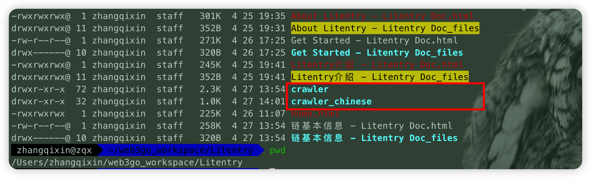

# env
* python 3.8.0+
* 安装python依赖 [requirements](requirements.txt)
```shell
pip install -r requirements.txt 
```
# setting & run
1. Set the address of the crawl result file where var name is _FILE_BASE_PATH in crawler.py
```python
# like this
_FILE_BASE_PATH = '/Users/zhangqixin/web3go_workspace/Litentry/crawler/'
_FILE_BASE_PATH = '/Users/zhangqixin/web3go_workspace/Litentry/crawler_chinese/'
```
2. run python
```shell
python crawler.py
python crawler_chinese.py
```
# result
Find it in the path you set
